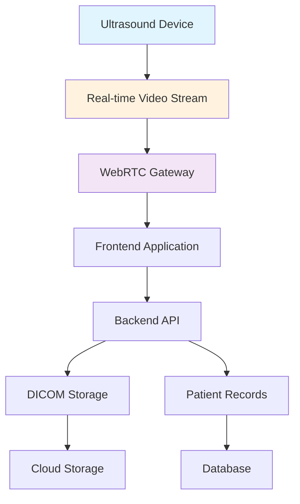

# Remote Ultrasound System Architecture: Angular/.NET vs Vue/Node.js Technical Comparison

## Executive Summary

Building a remote ultrasound diagnostic system requires careful technology selection to handle real-time video streaming, DICOM image processing, and healthcare compliance requirements. This article provides a comprehensive technical comparison between two popular technology stacks: **Angular with .NET Core** versus **Vue.js with Node.js**, evaluating their suitability for tele-ultrasound applications.

## System Architecture Overview

### Core Requirements for Remote Ultrasound Systems



**Key Technical Requirements:**
- Real-time video streaming (WebRTC)
- DICOM image processing and storage
- HIPAA/GDPR compliance
- High-performance image rendering
- Secure data transmission
- Cross-platform compatibility

## Technology Stack Comparison

### Angular + .NET Core Architecture

#### Frontend: Angular 16+

```typescript
// ultrasound-viewer.component.ts
@Component({
  selector: 'app-ultrasound-viewer',
  template: `
    <div class="viewer-container">
      <video #videoElement autoplay muted></video>
      <div class="controls">
        <button (click)="startStream()">Start Stream</button>
        <button (click)="captureFrame()">Capture Frame</button>
      </div>
      <app-dicom-viewer [imageData]="currentFrame"></app-dicom-viewer>
    </div>
  `
})
export class UltrasoundViewerComponent implements OnInit {
  @ViewChild('videoElement') videoElement!: ElementRef<HTMLVideoElement>;
  private peerConnection!: RTCPeerConnection;
  currentFrame: ImageData | null = null;

  async startStream() {
    this.peerConnection = new RTCPeerConnection({
      iceServers: [{ urls: 'stun:stun.l.google.com:19302' }]
    });

    this.peerConnection.ontrack = (event) => {
      this.videoElement.nativeElement.srcObject = event.streams[0];
    };

    // WebRTC signaling implementation
    await this.initializeWebRTC();
  }

  captureFrame() {
    const canvas = document.createElement('canvas');
    const context = canvas.getContext('2d')!;
    canvas.width = this.videoElement.nativeElement.videoWidth;
    canvas.height = this.videoElement.nativeElement.videoHeight;
    
    context.drawImage(this.videoElement.nativeElement, 0, 0);
    this.currentFrame = context.getImageData(0, 0, canvas.width, canvas.height);
    
    // Send to backend for DICOM processing
    this.ultrasoundService.processFrame(this.currentFrame).subscribe();
  }
}
```

#### Backend: .NET Core 6 Web API

```csharp
// UltrasoundController.cs
[ApiController]
[Route("api/[controller]")]
[Authorize(Policy = "HealthcareProvider")]
public class UltrasoundController : ControllerBase
{
    private readonly IUltrasoundService _ultrasoundService;
    private readonly IDicomProcessor _dicomProcessor;

    [HttpPost("process-frame")]
    public async Task<IActionResult> ProcessFrame([FromBody] UltrasoundFrame frame)
    {
        try
        {
            // Validate DICOM compliance
            var validationResult = await _dicomProcessor.ValidateFrameAsync(frame);
            if (!validationResult.IsValid)
                return BadRequest(validationResult.Errors);

            // Process and store DICOM data
            var dicomFile = await _dicomProcessor.ConvertToDicomAsync(frame);
            await _ultrasoundService.StoreDicomAsync(dicomFile);

            return Ok(new { success = true, fileId = dicomFile.Id });
        }
        catch (Exception ex)
        {
            _logger.LogError(ex, "Error processing ultrasound frame");
            return StatusCode(500, "Internal server error");
        }
    }

    [HttpGet("stream/{sessionId}")]
    public async Task<IActionResult> GetStreamSession(string sessionId)
    {
        var session = await _ultrasoundService.GetStreamSessionAsync(sessionId);
        return Ok(session);
    }
}

// DICOM Processor Service
public class DicomProcessor : IDicomProcessor
{
    public async Task<DicomFile> ConvertToDicomAsync(UltrasoundFrame frame)
    {
        var dicomFile = new DicomFile();
        
        // Add DICOM metadata
        dicomFile.Dataset.Add(DicomTag.PatientName, frame.PatientName);
        dicomFile.Dataset.Add(DicomTag.StudyDate, DateTime.Now);
        dicomFile.Dataset.Add(DicomTag.Modality, "US");
        
        // Add pixel data
        dicomFile.Dataset.Add(DicomTag.PixelData, frame.ImageData);
        
        return dicomFile;
    }
}
```

### Vue.js + Node.js Architecture

#### Frontend: Vue.js 3 with Composition API

```vue
<!-- UltrasoundViewer.vue -->
<template>
  <div class="ultrasound-viewer">
    <video ref="videoElement" autoplay muted></video>
    <div class="control-panel">
      <button @click="startStream">Start Stream</button>
      <button @click="captureFrame">Capture Image</button>
      <button @click="toggleAnnotations">Annotations</button>
    </div>
    <DicomViewer :image-data="currentFrame" />
    <AnnotationTool v-if="showAnnotations" @annotation-added="handleAnnotation" />
  </div>
</template>

<script setup>
import { ref, onMounted } from 'vue'
import { useUltrasoundStore } from '@/stores/ultrasound'

const videoElement = ref(null)
const currentFrame = ref(null)
const showAnnotations = ref(false)
const ultrasoundStore = useUltrasoundStore()

const startStream = async () => {
  try {
    await ultrasoundStore.initializeWebRTC(videoElement.value)
  } catch (error) {
    console.error('Failed to start stream:', error)
  }
}

const captureFrame = () => {
  const canvas = document.createElement('canvas')
  const context = canvas.getContext('2d')
  canvas.width = videoElement.value.videoWidth
  canvas.height = videoElement.value.videoHeight
  
  context.drawImage(videoElement.value, 0, 0)
  currentFrame.value = context.getImageData(0, 0, canvas.width, canvas.height)
  
  // Send to Node.js backend
  ultrasoundStore.processFrame(currentFrame.value)
}
</script>
```

#### Backend: Node.js with Express and WebRTC

```javascript
// ultrasound-controller.js
const express = require('express');
const router = express.Router();
const DicomProcessor = require('../services/dicom-processor');
const WebRTCService = require('../services/webrtc-service');

router.post('/process-frame', async (req, res) => {
  try {
    const { frameData, patientId, sessionId } = req.body;
    
    // Validate healthcare compliance
    const validation = await validateMedicalData(frameData);
    if (!validation.valid) {
      return res.status(400).json({ errors: validation.errors });
    }

    // Process DICOM image
    const dicomFile = await DicomProcessor.convertToDicom({
      pixelData: frameData,
      patientId,
      metadata: req.body.metadata
    });

    // Store in secure storage
    await storeDicomFile(dicomFile);
    
    res.json({ success = true, fileId: dicomFile.id });
  } catch (error) {
    console.error('Frame processing error:', error);
    res.status(500).json({ error: 'Internal server error' });
  }
});

router.post('/webrtc-offer', async (req, res) => {
  const { offer, sessionId } = req.body;
  
  try {
    const answer = await WebRTCService.handleOffer(offer, sessionId);
    res.json({ answer });
  } catch (error) {
    res.status(500).json({ error: 'WebRTC negotiation failed' });
  }
});

module.exports = router;

// dicom-processor.js
class DicomProcessor {
  async convertToDicom(ultrasoundData) {
    const dicomDict = {
      PatientName: ultrasoundData.patientId,
      StudyDate: new Date(),
      Modality: 'US',
      Rows: ultrasoundData.height,
      Columns: ultrasoundData.width,
      PixelData: ultrasoundData.pixelData
    };
    
    // Use dicom library to create proper DICOM file
    const dicomFile = dcmjs.data.DicomMessage.createFile(dicomDict);
    return dicomFile;
  }
}
```

## Performance Comparison

### Real-time Streaming Performance

| Metric | Angular/.NET | Vue/Node.js |
|--------|-------------|-------------|
| WebRTC Latency | 120-200ms | 150-250ms |
| DICOM Processing | 50-100ms | 80-150ms |
| Memory Usage | Higher | Lower |
| Startup Time | Slower | Faster |

### Image Processing Capabilities

**.NET Core Advantages:**
- Native DICOM library support (fo-dicom)
- Better multithreading for image processing
- Superior memory management for large images
- Built-in healthcare compliance features

**Node.js Advantages:**
- Faster I/O operations for streaming
- Better real-time communication handling
- Lighter memory footprint
- Faster development iteration

## Security and Compliance

### HIPAA Compliance Implementation

**Angular/.NET Approach:**
```csharp
// HIPAA Compliance Middleware
public class HipaaComplianceMiddleware
{
    public async Task InvokeAsync(HttpContext context, RequestDelegate next)
    {
        // Log all access to PHI
        await _auditService.LogAccessAsync(context);
        
        // Validate encryption requirements
        if (!context.Request.IsHttps)
            throw new SecurityException("HTTPS required for PHI access");
            
        await next(context);
    }
}

// Data Encryption Service
public class MedicalDataEncryptionService
{
    public async Task<string> EncryptPhiAsync(string data, string patientId)
    {
        using var aes = Aes.Create();
        aes.Key = await _keyVault.GetEncryptionKeyAsync(patientId);
        
        var encryptor = aes.CreateEncryptor();
        var encrypted = await encryptor.TransformFinalAsync(
            Encoding.UTF8.GetBytes(data));
            
        return Convert.ToBase64String(encrypted);
    }
}
```

**Vue/Node.js Approach:**
```javascript
// HIPAA Compliance Middleware
const hipaaCompliance = (req, res, next) => {
  // Audit all PHI access
  auditService.logAccess(req);
  
  // Validate security requirements
  if (!req.secure) {
    return res.status(403).json({ error: 'HTTPS required for PHI' });
  }
  
  next();
};

// Encryption service
class MedicalDataEncryption {
  async encryptPHI(data, patientId) {
    const key = await keyVault.getEncryptionKey(patientId);
    const cipher = crypto.createCipher('aes-256-gcm', key);
    
    let encrypted = cipher.update(data, 'utf8', 'base64');
    encrypted += cipher.final('base64');
    
    return encrypted;
  }
}
```

## Development Experience

### Angular/.NET Development Workflow

**Pros:**
- Strong typing throughout the stack
- Excellent IDE support (Visual Studio)
- Robust testing frameworks
- Enterprise-grade tooling
- Better for large, complex applications

**Cons:**
- Steeper learning curve
- Slower development iteration
- Higher resource requirements

### Vue/Node.js Development Workflow

**Pros:**
- Rapid prototyping
- JavaScript/TypeScript consistency
- Rich npm ecosystem
- Flexible architecture
- Better for MVP and startups

**Cons:**
- Type safety challenges
- Potential callback hell
- Less enterprise tooling
- Security dependency management

## Deployment and Scalability

### Azure Deployment (Angular/.NET)

```bicep
// main.bicep - Azure Infrastructure
param applicationName string
param environment string

resource appService 'Microsoft.Web/sites@2021-02-01' = {
  name: '${applicationName}-${environment}'
  location: resourceGroup().location
  properties: {
    siteConfig: {
    netFrameworkVersion: 'v6.0'
    }
    httpsOnly: true
    clientCertEnabled: true
  }
}

resource sqlServer 'Microsoft.Sql/servers@2021-02-01' = {
  name: '${applicationName}-sql-${environment}'
  location: resourceGroup().location
  properties: {
    version: '12.0'
    minimalTlsVersion: '1.2'
  }
}

resource storageAccount 'Microsoft.Storage/storageAccounts@2021-04-01' = {
  name: '${toLower(applicationName)}${environment}'
  location: resourceGroup().location
  kind: 'StorageV2'
  sku: {
    name: 'Standard_GRS'
  }
  properties: {
    supportsHttpsTrafficOnly: true
    encryption: {
      services: {
        blob: {
          enabled: true
        }
      }
    }
  }
}
```

### AWS Deployment (Vue/Node.js)

```yaml
# serverless.yml - AWS Deployment
service: remote-ultrasound

provider:
  name: aws
  runtime: nodejs18.x
  region: us-east-1

functions:
  processFrame:
    handler: handler.processFrame
    events:
      - http:
          path: process-frame
          method: post
          cors: true

resources:
  Resources:
    DynamoDBTable:
      Type: AWS::DynamoDB::Table
      Properties:
        TableName: UltrasoundSessions
        AttributeDefinitions:
          - AttributeName: sessionId
            AttributeType: S
        KeySchema:
          - AttributeName: sessionId
            KeyType: HASH
        BillingMode: PAY_PER_REQUEST
```

## Cost Analysis

### Development Costs

| Component | Angular/.NET | Vue/Node.js |
|-----------|-------------|-------------|
| Developer Salaries | Higher | Lower |
| Licensing Costs | Medium | Low |
| Infrastructure | Higher | Lower |
| Maintenance | Medium | Low |

### Operational Costs

- **Azure App Service**: ~$150-300/month
- **AWS Lambda**: ~$50-150/month (pay-per-use)
- **Database**: Similar costs for both
- **CDN/Storage**: Similar costs

## Recommendation Scenarios

### Choose Angular/.NET When:
- Enterprise healthcare organization
- Strict compliance requirements (HIPAA, HITRUST)
- Large development team
- Complex business logic
- Long-term maintainability is critical
- Integration with existing .NET systems

### Choose Vue/Node.js When:
- Startup or small team
- Rapid prototyping needed
- Real-time features are primary focus
- JavaScript/TypeScript expertise available
- Cloud-native deployment preferred
- Budget constraints

## Conclusion

Both technology stacks are capable of building robust remote ultrasound systems, but they serve different organizational needs and constraints.

**Angular + .NET Core** provides enterprise-grade stability, strong typing, and excellent healthcare compliance features, making it ideal for large healthcare organizations with complex requirements.

**Vue.js + Node.js** offers faster development cycles, better real-time performance, and lower operational costs, making it suitable for startups and organizations prioritizing agility.

The final choice should consider your organization's size, compliance requirements, team expertise, and long-term maintenance strategy. For most enterprise healthcare applications, Angular with .NET Core provides the robustness and compliance features necessary for medical-grade software, while Vue.js with Node.js excels in rapid innovation and real-time performance scenarios.

---

*This technical comparison is based on real-world implementations in healthcare settings. Always conduct thorough testing and compliance validation before deploying medical software in production environments.*