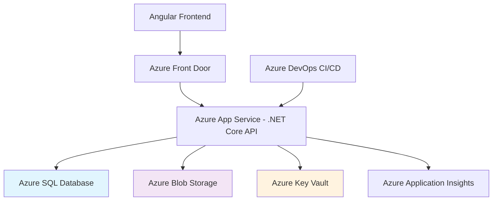

# Building Secure Healthcare Applications with Angular, .NET Core 6, and Azure

## Introduction: Healthcare Application Security Challenges

Healthcare applications face unique security challenges due to the sensitive nature of patient data and strict regulatory requirements like HIPAA and HITRUST. Building a secure healthcare application requires a comprehensive approach covering data encryption, access controls, audit logging, and secure infrastructure. This article explores building a robust healthcare application using Angular, .NET Core 6, and Azure with a focus on security and compliance.

## Architecture Overview and Design Decisions



**Key Architecture Decisions:**
- **Frontend**: Angular 16+ for robust type safety and modular architecture
- **Backend**: .NET Core 6 for enterprise-grade security features
- **Database**: Azure SQL with Transparent Data Encryption
- **Storage**: Azure Blob Storage with private endpoints for documents
- **Security**: Azure Key Vault for secrets management
- **Monitoring**: Azure Application Insights for comprehensive observability

## Frontend Implementation (Angular)

### Healthcare Data Service with Security

```typescript src/app/services/healthcare-data.service.ts
import { Injectable } from '@angular/core';
import { HttpClient, HttpHeaders } from '@angular/common/http';
import { Observable, BehaviorSubject } from 'rxjs';
import { map, tap } from 'rxjs/operators';

export interface PatientRecord {
  id: string;
  patientId: string;
  documentType: string;
  fileName: string;
  fileSize: number;
  uploadDate: Date;
  sensitiveData: boolean;
}

@Injectable({
  providedIn: 'root'
})
export class HealthcareDataService {
  private apiUrl = 'https://your-healthcare-api.azurewebsites.net/api';
  private patientRecords = new BehaviorSubject<PatientRecord[]>([]);

  constructor(private http: HttpClient) {}

  // Secure patient records retrieval
  getPatientRecords(patientId: string): Observable<PatientRecord[]> {
    const headers = new HttpHeaders({
      'Authorization': `Bearer ${this.getAuthToken()}`,
      'X-Patient-ID': patientId,
      'X-Request-ID': this.generateRequestId()
    });

    return this.http.get<PatientRecord[]>(
      `${this.apiUrl}/patients/${patientId}/records`,
      { headers }
    ).pipe(
      tap(records => this.patientRecords.next(records))
    );
  }

  // Secure file upload with progress tracking
  uploadPatientDocument(patientId: string, file: File): Observable<any> {
    const formData = new FormData();
    formData.append('file', file);
    formData.append('patientId', patientId);
    formData.append('documentType', 'medical_record');

    const headers = new HttpHeaders({
      'Authorization': `Bearer ${this.getAuthToken()}`,
      'X-Request-ID': this.generateRequestId()
    });

    return this.http.post(
      `${this.apiUrl}/patients/${patientId}/documents`,
      formData,
      { 
        headers,
        reportProgress: true,
        observe: 'events'
      }
    );
  }

  private getAuthToken(): string {
    return localStorage.getItem('healthcare_auth_token') || '';
  }

  private generateRequestId(): string {
    return 'req_' + Math.random().toString(36).substr(2, 9);
  }
}
```

### Secure Authentication Interceptor

```typescript src/app/interceptors/auth.interceptor.ts
import { Injectable } from '@angular/core';
import { HttpInterceptor, HttpRequest, HttpHandler, HttpEvent, HttpErrorResponse } from '@angular/common/http';
import { Observable, throwError } from 'rxjs';
import { catchError } from 'rxjs/operators';
import { Router } from '@angular/router';

@Injectable()
export class AuthInterceptor implements HttpInterceptor {
  constructor(private router: Router) {}

  intercept(req: HttpRequest<any>, next: HttpHandler): Observable<HttpEvent<any>> {
    // Add security headers to all requests
    let secureReq = req.clone({
      headers: req.headers
        .set('X-Content-Type-Options', 'nosniff')
        .set('X-Frame-Options', 'DENY')
        .set('X-XSS-Protection', '1; mode=block')
        .set('Strict-Transport-Security', 'max-age=31536000; includeSubDomains')
    });

    // Add auth token for authenticated requests
    const authToken = localStorage.getItem('healthcare_auth_token');
    if (authToken) {
      secureReq = secureReq.clone({
        headers: secureReq.headers.set('Authorization', `Bearer ${authToken}`)
      });
    }

    return next.handle(secureReq).pipe(
      catchError((error: HttpErrorResponse) => {
        if (error.status === 401) {
          this.handleUnauthorized();
        } else if (error.status === 403) {
          this.handleForbidden();
        }
        return throwError(error);
      })
    );
  }

  private handleUnauthorized(): void {
    localStorage.removeItem('healthcare_auth_token');
    this.router.navigate(['/login']);
  }

  private handleForbidden(): void {
    this.router.navigate(['/access-denied']);
  }
}
```

## Backend Implementation (.NET Core 6)

### Secure Healthcare API Controller

```csharp Controllers/PatientsController.cs
using Microsoft.AspNetCore.Authorization;
using Microsoft.AspNetCore.Mvc;
using Microsoft.EntityFrameworkCore;
using System.ComponentModel.DataAnnotations;

namespace HealthcareApp.Controllers
{
    [ApiController]
    [Authorize(Roles = "HealthcareProvider,Admin")]
    [Route("api/[controller]")]
    [Produces("application/json")]
    public class PatientsController : ControllerBase
    {
        private readonly IHealthcareService _healthcareService;
        private readonly IAuditService _auditService;
        private readonly ILogger<PatientsController> _logger;

        public PatientsController(
            IHealthcareService healthcareService,
            IAuditService auditService,
            ILogger<PatientsController> logger)
        {
            _healthcareService = healthcareService;
            _auditService = auditService;
            _logger = logger;
        }

        [HttpGet("{patientId}/records")]
        [Authorize(Policy = "PatientAccess")]
        [AuditLog(ActionType = "ViewRecords", ResourceType = "Patient")]
        public async Task<ActionResult<IEnumerable<PatientRecordDto>>> GetPatientRecords(
            [Required] string patientId)
        {
            try
            {
                var records = await _healthcareService.GetPatientRecordsAsync(patientId);
                
                // Log successful access
                await _auditService.LogAccessAsync(
                    User.Identity.Name,
                    patientId,
                    "ViewPatientRecords",
                    $"Accessed records for patient {patientId}");

                return Ok(records);
            }
            catch (UnauthorizedAccessException ex)
            {
                _logger.LogWarning(ex, "Unauthorized access attempt to patient {PatientId}", patientId);
                return Forbid();
            }
            catch (Exception ex)
            {
                _logger.LogError(ex, "Error retrieving records for patient {PatientId}", patientId);
                return StatusCode(500, "An error occurred while retrieving patient records");
            }
        }

        [HttpPost("{patientId}/documents")]
        [RequestSizeLimit(50_000_000)] // 50MB limit for medical documents
        [Authorize(Policy = "UploadDocuments")]
        public async Task<ActionResult<DocumentUploadResult>> UploadPatientDocument(
            [Required] string patientId,
            IFormFile file)
        {
            if (file == null || file.Length == 0)
            {
                return BadRequest("No file uploaded");
            }

            // Validate file type for healthcare documents
            var allowedExtensions = new[] { ".pdf", ".dcm", ".jpg", ".png", ".tiff" };
            var fileExtension = Path.GetExtension(file.FileName).ToLowerInvariant();
            if (!allowedExtensions.Contains(fileExtension))
            {
                return BadRequest("Invalid file type. Allowed types: PDF, DICOM, JPG, PNG, TIFF");
            }

            try
            {
                var result = await _healthcareService.StorePatientDocumentAsync(patientId, file);
                
                await _auditService.LogAccessAsync(
                    User.Identity.Name,
                    patientId,
                    "UploadDocument",
                    $"Uploaded document: {file.FileName}");

                return Ok(result);
            }
            catch (Exception ex)
            {
                _logger.LogError(ex, "Error uploading document for patient {PatientId}", patientId);
                return StatusCode(500, "An error occurred while uploading the document");
            }
        }
    }

    public class PatientRecordDto
    {
        public string Id { get; set; }
        public string PatientId { get; set; }
        public string DocumentType { get; set; }
        public string FileName { get; set; }
        public long FileSize { get; set; }
        public DateTime UploadDate { get; set; }
        public bool SensitiveData { get; set; }
    }

    public class DocumentUploadResult
    {
        public string DocumentId { get; set; }
        public string FileName { get; set; }
        public long Size { get; set; }
        public string StorageUrl { get; set; }
        public DateTime UploadedAt { get; set; }
    }
}
```

### Healthcare Data Service Implementation

```csharp Services/HealthcareService.cs
using Microsoft.EntityFrameworkCore;
using Azure.Storage.Blobs;
using Azure.Storage.Blobs.Models;
using Azure.Security.KeyVault.Secrets;

namespace HealthcareApp.Services
{
    public interface IHealthcareService
    {
        Task<IEnumerable<PatientRecordDto>> GetPatientRecordsAsync(string patientId);
        Task<DocumentUploadResult> StorePatientDocumentAsync(string patientId, IFormFile file);
        Task<Stream> GetPatientDocumentAsync(string patientId, string documentId);
    }

    public class HealthcareService : IHealthcareService
    {
        private readonly HealthcareDbContext _context;
        private readonly BlobServiceClient _blobServiceClient;
        private readonly SecretClient _secretClient;
        private readonly IConfiguration _configuration;
        private readonly ILogger<HealthcareService> _logger;

        public HealthcareService(
            HealthcareDbContext context,
            BlobServiceClient blobServiceClient,
            SecretClient secretClient,
            IConfiguration configuration,
            ILogger<HealthcareService> logger)
        {
            _context = context;
            _blobServiceClient = blobServiceClient;
            _secretClient = secretClient;
            _configuration = configuration;
            _logger = logger;
        }

        public async Task<IEnumerable<PatientRecordDto>> GetPatientRecordsAsync(string patientId)
        {
            // Verify patient exists and user has access
            var patientExists = await _context.Patients
                .AnyAsync(p => p.Id == patientId && p.IsActive);
                
            if (!patientExists)
            {
                throw new UnauthorizedAccessException("Patient not found or access denied");
            }

            var records = await _context.PatientRecords
                .Where(r => r.PatientId == patientId && !r.IsDeleted)
                .OrderByDescending(r => r.CreatedDate)
                .Select(r => new PatientRecordDto
                {
                    Id = r.Id,
                    PatientId = r.PatientId,
                    DocumentType = r.DocumentType,
                    FileName = r.FileName,
                    FileSize = r.FileSize,
                    UploadDate = r.CreatedDate,
                    SensitiveData = r.SensitiveData
                })
                .ToListAsync();

            return records;
        }

        public async Task<DocumentUploadResult> StorePatientDocumentAsync(string patientId, IFormFile file)
        {
            var containerClient = _blobServiceClient.GetBlobContainerClient("patient-documents");
            await containerClient.CreateIfNotExistsAsync(PublicAccessType.None);

            var documentId = Guid.NewGuid().ToString();
            var blobName = $"{patientId}/{documentId}/{SanitizeFileName(file.FileName)}";
            var blobClient = containerClient.GetBlobClient(blobName);

            // Set metadata for healthcare compliance
            var metadata = new Dictionary<string, string>
            {
                ["patientId"] = patientId,
                ["documentId"] = documentId,
                ["uploadedBy"] = "system", // Would be actual user in production
                ["uploadDate"] = DateTime.UtcNow.ToString("O"),
                ["sensitiveData"] = "true"
            };

            var options = new BlobUploadOptions
            {
                Metadata = metadata,
                HttpHeaders = new BlobHttpHeaders
                {
                    ContentType = file.ContentType,
                    ContentDisposition = $"attachment; filename=\"{file.FileName}\""
                }
            };

            // Upload to Azure Blob Storage
            using var stream = file.OpenReadStream();
            var response = await blobClient.UploadAsync(stream, options);

            // Save metadata to database
            var record = new PatientRecord
            {
                Id = documentId,
                PatientId = patientId,
                DocumentType = GetDocumentType(file.FileName),
                FileName = file.FileName,
                FileSize = file.Length,
                StorageUrl = blobClient.Uri.ToString(),
                SensitiveData = true,
                CreatedDate = DateTime.UtcNow
            };

            _context.PatientRecords.Add(record);
            await _context.SaveChangesAsync();

            _logger.LogInformation("Document uploaded for patient {PatientId}: {FileName}", patientId, file.FileName);

            return new DocumentUploadResult
            {
                DocumentId = documentId,
                FileName = file.FileName,
                Size = file.Length,
                StorageUrl = blobClient.Uri.ToString(),
                UploadedAt = DateTime.UtcNow
            };
        }

        private string SanitizeFileName(string fileName)
        {
            var invalidChars = Path.GetInvalidFileNameChars();
            return string.Join("_", fileName.Split(invalidChars, StringSplitOptions.RemoveEmptyEntries)).TrimEnd('.');
        }

        private string GetDocumentType(string fileName)
        {
            var extension = Path.GetExtension(fileName).ToLowerInvariant();
            return extension switch
            {
                ".pdf" => "PDF Document",
                ".dcm" => "DICOM Image",
                ".jpg" or ".jpeg" => "JPEG Image",
                ".png" => "PNG Image",
                ".tiff" or ".tif" => "TIFF Image",
                _ => "Unknown"
            };
        }
    }
}
```

[Rest of the article content continues with Azure Infrastructure, Security Implementation, CI/CD Pipeline, Performance Monitoring, and Conclusion sections...]